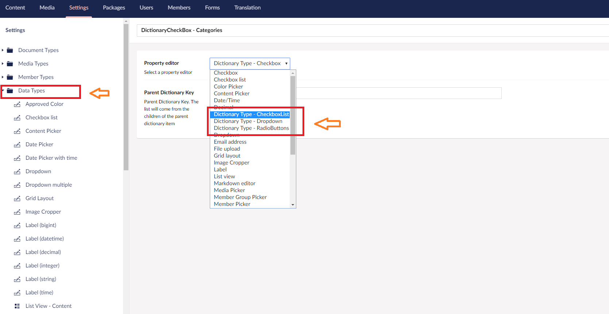
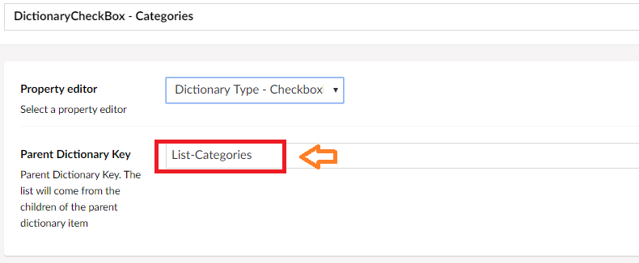

[](https://www.nuget.org/packages/DictionaryType) [](https://our.umbraco.org/projects/backoffice-extensions/dictionary-type)

# Dictionary Type #

Umbraco DataType which values are based from **dictionary items**. An alternative for creating custom doctype as datasource for your dropdowns, checkbox list or radio buttons.

#### 3 property editors 

1. Checkbox List
2. Radio Buttons
3. Dropdown

#### Installation

##### 1. Umbraco package

Install from the developer section in Umbraco or download from the link below

> [https://our.umbraco.com/packages/backoffice-extensions/dictionary-type/](https://our.umbraco.com/packages/backoffice-extensions/dictionary-type/)

##### 2. NuGet package

Install from [NuGet](https://www.nuget.org/packages/DictionaryType/) package manager or run the following command in Visual Studio package manage console:

```c
PM> Install-Package DictionaryType
```

#### Instructions

1. Create a parent dictionary item with it's children being the list items.
2. Add the parent dictionary key name into the **Parent Dictionary Key** field in the Dictionary Property Editor.
3. Add the created DataType into a DocumentType or MemberType and you'll have your child items as your choices in the list.






#### Using the dictionary list for other implementation

```c#
using DictionaryType.Foundation.Core.Helpers;
...
    
public class YourClass
{
    private readonly IDictionaryTypeHelper _dictionaryHelper;

    public YourClass(IDictionaryTypeHelper dictionaryHelper)
    {
        _dictionaryHelper = dictionaryHelper;
    }

    public List<SelectListItem> GetDictionaryList(string parentKey, string language = null)
    {
        var result = new List<SelectListItem>();

        //Get the dictionary list
        var dictionaryList = _dictionaryHelper.GetDictionaryList(parentKey, language);

        if (dictionaryList != null && dictionaryList.Any())
        {
            result.AddRange(dictionaryList.Select(x => new SelectListItem() { Value = x.Key, Text = x.Value }));

        }

        return result;

    }
}
```

<a target="_blank" href="https://icons8.com/icons/set/dictionary">Dictionary icon</a> by <a target="_blank" href="https://icons8.com">Icons8</a>